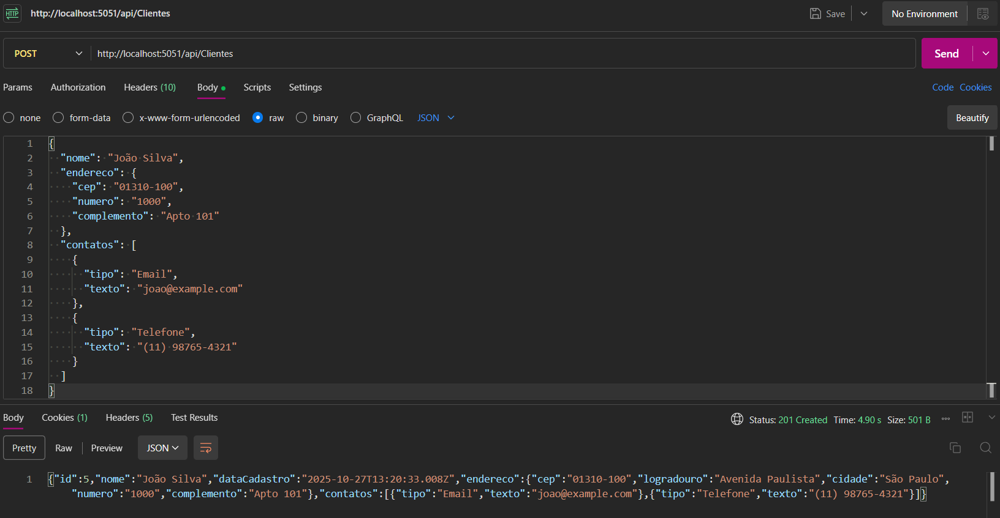
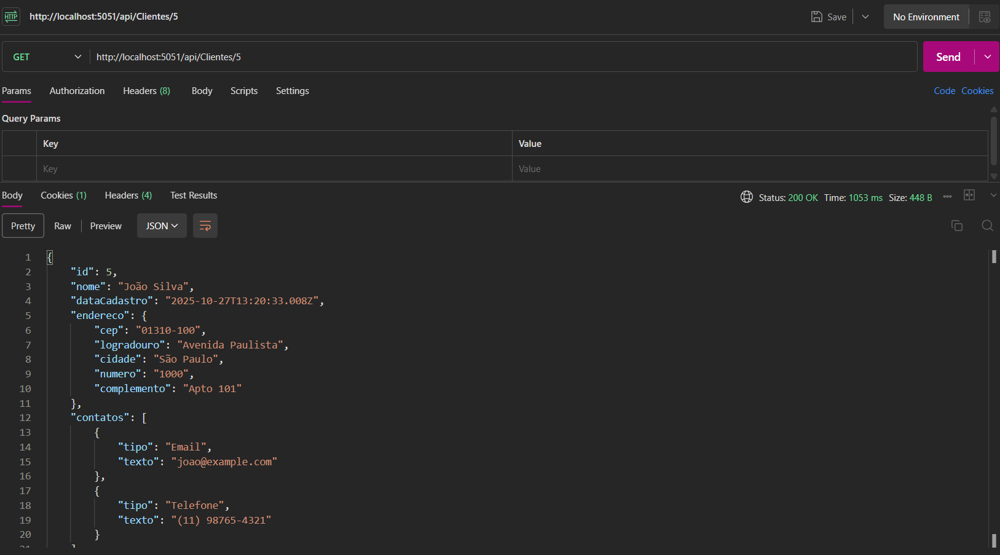
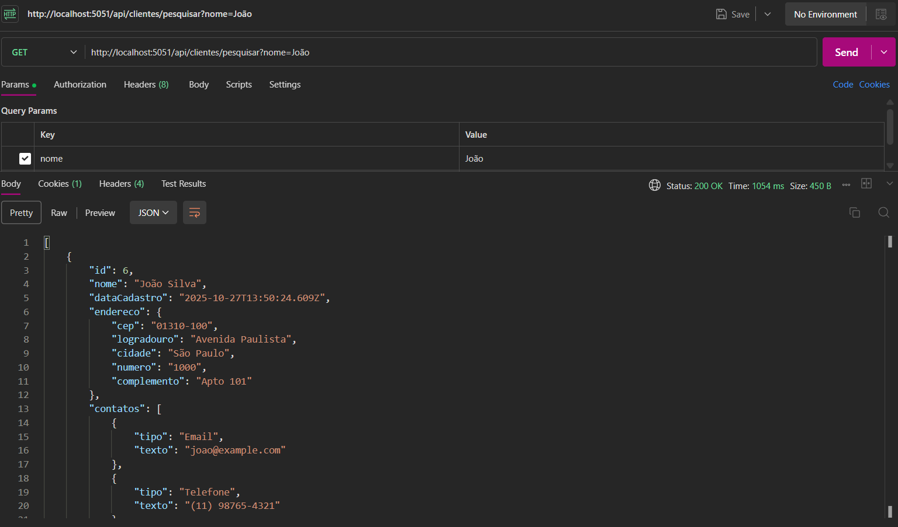
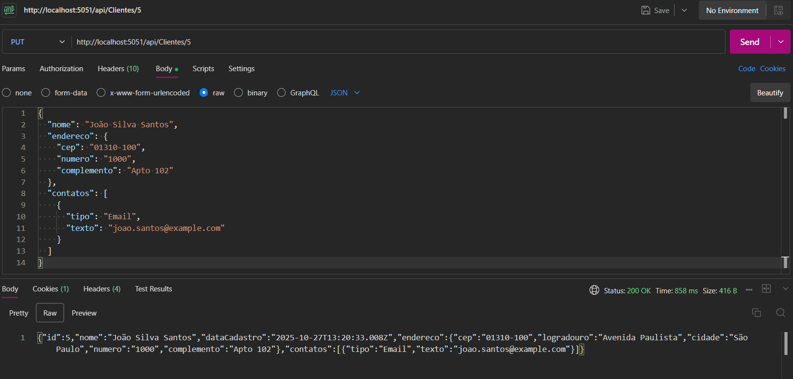
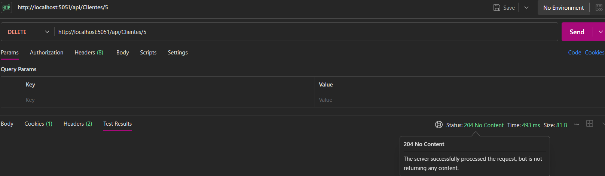

# 🏢 Desafio Clientes - WebAPI RESTful

> **Teste Técnico - Muralis**  
> API RESTful para gerenciamento de clientes desenvolvida com .NET 8 e Clean Architecture

[](https://dotnet.microsoft.com/)
[](https://docs.microsoft.com/en-us/dotnet/csharp/)
[](https://docs.microsoft.com/en-us/ef/)
[](https://www.microsoft.com/sql-server)

---

## Índice

- [Sobre o Projeto](#-sobre-o-projeto)
- [Stack Utilizada](#-stack-utilizada)
- [Arquitetura e Padrões](#-arquitetura-e-padrões)
- [Estrutura do Projeto](#-estrutura-do-projeto)
- [Funcionalidades](#-funcionalidades)
- [Como Executar](#-como-executar)
- [Demonstração da API](#-demonstracao-da-api)
- [Diferenciais Implementados](#-diferenciais-implementados)

---

## Sobre o Projeto

- API desenvolvida para gerenciar o cadastro completo de clientes, incluindo informações pessoais, endereços (com integração automática ao ViaCEP) e múltiplos contatos. O projeto foi estruturado seguindo os princípios da **Clean Architecture** e **SOLID**, garantindo escalabilidade, manutenibilidade e testabilidade.
---

## Stack Utilizada

### Core
- **.NET 8.0** - Framework principal
- **C# 12** - Linguagem de programação com recursos modernos
- **ASP.NET Core Web API** - Framework para construção de APIs RESTful

### Banco de Dados
- **Entity Framework Core 9.0** - ORM para acesso a dados
- **SQL Server** - Sistema de gerenciamento de banco de dados
- **Code First Migrations** - Controle de versão do banco de dados

### Bibliotecas e Frameworks
- **AutoMapper 12.0** - Mapeamento objeto-objeto (DTO ↔ Entidades)
- **FluentValidation 12.0** - Validação de modelos com fluent interface
- **Swashbuckle (Swagger)** - Documentação e testes da API
- **HttpClient** - Consumo de APIs externas (ViaCEP)

---

## Arquitetura e Padrões

### Clean Architecture

O projeto segue os princípios da **Clean Architecture**, dividido em 4 camadas independentes:

```
┌─────────────────────────────────────────┐
│         DesafioClientes.API             │  ← Camada de Apresentação
│  (Controllers, Program.cs, Swagger)     │
└────────────────┬────────────────────────┘
                 │
┌────────────────▼────────────────────────┐
│      DesafioClientes.Application        │  ← Camada de Aplicação
│  (Services, DTOs, Validators, Mappers)  │
└────────────────┬────────────────────────┘
                 │
┌────────────────▼────────────────────────┐
│       DesafioClientes.Domain            │  ← Camada de Domínio
│      (Entities, Interfaces)             │
└────────────────┬────────────────────────┘
                 │
┌────────────────▼────────────────────────┐
│    DesafioClientes.Infrastructure       │  ← Camada de Infraestrutura
│  (DbContext, Repositories, Migrations)  │
└─────────────────────────────────────────┘
```

### Padrões de Projeto Implementados

#### 1. **Repository Pattern**
- Abstração da camada de acesso a dados
- Interface `IClienteRepository` define o contrato
- Implementação concreta em `ClienteRepository`
- Facilita testes unitários e troca de tecnologia de persistência

#### 2. **Dependency Injection (DI)**
- Todas as dependências são injetadas via construtor
- Configuração centralizada no `Program.cs`
- Facilita manutenção e testes

#### 3. **DTO Pattern**
- Separação entre entidades de domínio e objetos de transferência
- `ClienteDTO`, `CriarClienteDTO`, `AtualizarClienteDTO`
- Previne over-posting e protege o modelo de domínio

#### 4. **Service Layer Pattern**
- Lógica de negócio centralizada em `ClienteService`
- Controllers enxutos, apenas roteamento
- Reutilização de código

#### 5. **Fluent Interface**
- Validações declarativas com FluentValidation
- Código limpo e legível
- Mensagens de erro personalizadas
---

## 📁 Estrutura do Projeto

```
DesafioClientes/
│
├── 📂 DesafioClientes.API/                    # Camada de Apresentação
│   ├── Controllers/
│   │   └── ClientesController.cs              # Endpoints REST
│   ├── Program.cs                             # Configuração e DI
│   ├── appsettings.json                       # Configurações
│   └── DesafioClientes.API.csproj
│
├── 📂 DesafioClientes.Application/            # Camada de Aplicação
│   ├── DTOs/
│   │   ├── ClienteDTO.cs                      # Objeto de transferência
│   │   ├── CriarClienteDTO.cs                 # Entrada para criação
│   │   ├── AtualizarClienteDTO.cs             # Entrada para atualização
│   │   ├── PagedResultDTO.cs                  # Paginação genérica
│   │   └── ViaCepResponseDTO.cs               # Resposta do ViaCEP
│   ├── Interfaces/
│   │   ├── IClienteService.cs                 # Contrato do serviço
│   │   └── IViaCepService.cs                  # Contrato ViaCEP
│   ├── Mappings/
│   │   └── MappingProfile.cs                  # Perfis AutoMapper
│   ├── Services/
│   │   └── ClienteService.cs                  # Lógica de negócio
│   ├── Validators/
│   │   ├── CriarClienteValidator.cs           # Validação criação
│   │   ├── AtualizarClienteValidator.cs       # Validação atualização
│   │   ├── EnderecoValidator.cs               # Validação endereço
│   │   └── ContatoValidator.cs                # Validação contato
│   └── DesafioClientes.Application.csproj
│
├── 📂 DesafioClientes.Domain/                 # Camada de Domínio
│   ├── Entities/
│   │   ├── Cliente.cs                         # Entidade principal
│   │   ├── Endereco.cs                        # Entidade endereço
│   │   └── Contato.cs                         # Entidade contato
│   ├── Interfaces/
│   │   └── IClienteRepository.cs              # Contrato repositório
│   └── DesafioClientes.Domain.csproj
│
└── 📂 DesafioClientes.Infrastructure/         # Camada de Infraestrutura
    ├── Data/
    │   ├── ApplicationDbContext.cs            # Contexto EF Core
    │   └── Configurations/
    │       ├── ClienteConfiguration.cs        # Configuração Fluent API
    │       ├── EnderecoConfiguration.cs
    │       └── ContatoConfiguration.cs
    ├── ExternalServices/
    │   └── ViaCepService.cs                   # Integração ViaCEP
    ├── Repositories/
    │   └── ClienteRepository.cs               # Implementação repositório
    ├── Migrations/                            # Migrações EF Core
    └── DesafioClientes.Infrastructure.csproj
```

---

## Funcionalidades

### Gestão de Clientes

| Funcionalidade | Método | Endpoint | Descrição |
|---------------|--------|----------|-----------|
| **Listar todos** | `GET` | `/api/clientes?pagina=1&tamanhoPagina=10` | Retorna clientes paginados |
| **Buscar por ID** | `GET` | `/api/clientes/{id}` | Retorna cliente específico |
| **Pesquisar** | `GET` | `/api/clientes/pesquisar?nome=João` | Busca por nome (like) |
| **Criar** | `POST` | `/api/clientes` | Cria novo cliente |
| **Atualizar** | `PUT` | `/api/clientes/{id}` | Atualiza cliente existente |
| **Excluir** | `DELETE` | `/api/clientes/{id}` | Remove cliente |

### Recursos Adicionais

- ✅ **Paginação**: Controle de `pagina` e `tamanhoPagina`
- ✅ **Pesquisa**: Filtro por nome do cliente
- ✅ **Auto-preenchimento**: CEP → Endereço completo via ViaCEP
- ✅ **Validação**: Regras de negócio em todas as entradas
- ✅ **Documentação**: Swagger UI disponível na raiz do projeto

---

## 🔧 Como Executar

### Pré-requisitos

- [.NET 8 SDK](https://dotnet.microsoft.com/download/dotnet/8.0)
- [SQL Server](https://www.microsoft.com/sql-server) (Express ou superior)
- [Visual Studio 2022](https://visualstudio.microsoft.com/) ou [VS Code](https://code.visualstudio.com/)

### Passo a Passo

#### 1. Clone o repositório
```bash
git clone <url-do-repositorio>
cd DesafioCliente
```

#### 2. Configure a string de conexão
Edite o arquivo `src/DesafioClientes.API/appsettings.json`:

```json
{
  "ConnectionStrings": {
    "DefaultConnection": "Server=localhost\\SQLEXPRESS;Database=DesafioClientesDb;Trusted_Connection=true;TrustServerCertificate=true"
  }
}
```

> **Nota**: Ajuste o `Server` conforme sua instalação do SQL Server.

#### 3. Restaure as dependências
```bash
dotnet restore
```

#### 4. Execute as migrações
```bash
cd src/DesafioClientes.API
dotnet ef database update
```

#### 5. Execute a aplicação
```bash
dotnet run
```

#### 6. Acesse o Swagger
Abra o navegador em: **`https://localhost:5051/swagger`** (a porta será exibida no console)

---

## Demonstração da API

A seguir, apresentamos os testes manuais realizados via **Swagger** para comprovar o funcionamento da API.

> 💡 **Testes Completos Disponíveis**:  
> - Collection Postman (JSON): [`docs/API Documentation.postman_collection.json`](./docs/API%20Documentation.postman_collection.json)  
> - Workspace Online: [Acesse aqui](https://jula-6045524.postman.co/workspace/DesafioAPIMuralis~79caa53a-e507-4786-b389-1ea2f48f8a4b/collection/43586873-a1e5d9be-426f-4f12-a8f3-1f6e6fe1e890?action=share&creator=43586873)

---


### 1. 📝 Criação de Cliente (POST)
**Regra Principal**: Ao enviar um novo cliente apenas com **CEP** e **Número**, a API consulta o **ViaCEP** e preenche automaticamente o **Logradouro** e a **Cidade** antes de salvar.

**Endpoint**: `POST /api/clientes`



---

### 2. 🔍 Consulta de Cliente por ID (GET)
A consulta pelo ID do cliente criado retorna os dados completos, incluindo o **endereço preenchido automaticamente pelo ViaCEP**.

**Endpoint**: `GET /api/clientes/{id}`



---

### 3. 🔎 Busca de Clientes por Nome (GET)
Permite buscar clientes através de um filtro por nome (busca parcial).

**Endpoint**: `GET /api/clientes/pesquisar?nome={termo}`



---

### 4. 📋 Listagem Paginada de Clientes (GET)
Retorna todos os clientes com suporte a paginação para melhor performance.

**Endpoint**: `GET /api/clientes?pagina=1&tamanhoPagina=10`


---

### 5. ✏️ Atualização de Cliente (PUT)
A API permite a atualização dos dados de um cliente existente, mantendo a validação e integração com ViaCEP.

**Endpoint**: `PUT /api/clientes/{id}`



---

### 6. 🗑️ Exclusão de Cliente (DELETE)
A API permite a exclusão de um cliente pelo seu ID, removendo também seus endereços e contatos (cascade delete).

**Endpoint**: `DELETE /api/clientes/{id}`



---
---
## Diferenciais Implementados

### 1. **Integração com API Externa (ViaCEP)**
```csharp
// Preenchimento automático de endereço a partir do CEP
public async Task<ViaCepResponseDTO?> ObterEnderecoPorCepAsync(string cep)
{
    var cepLimpo = cep.Replace("-", "").Trim();
    var response = await _httpClient.GetAsync($"ws/{cepLimpo}/json/");
    // ...
}
```
- HttpClient configurado como serviço tipado
- Tratamento de erros e CEPs inválidos
- Merge inteligente: dados do usuário têm prioridade sobre ViaCEP

### 2. **Paginação de Resultados**
```csharp
public class PagedResultDTO<T>
{
    public IEnumerable<T> Items { get; set; }
    public int TotalItems { get; set; }
    public int PageNumber { get; set; }
    public int PageSize { get; set; }
    public int TotalPages => (int)Math.Ceiling(TotalItems / (double)PageSize);
}
```
- Evita sobrecarga de dados
- Cálculo automático de total de páginas
- Parâmetros configuráveis via query string

### 3. **Validações Robustas**
```csharp
public class CriarClienteValidator : AbstractValidator<CriarClienteDTO>
{
    public CriarClienteValidator()
    {
        RuleFor(x => x.Nome)
            .NotEmpty().WithMessage("Nome é obrigatório")
            .MinimumLength(3).WithMessage("Nome deve ter no mínimo 3 caracteres")
            .MaximumLength(150).WithMessage("Nome deve ter no máximo 150 caracteres");
        // Validações em cascata para Endereco e Contatos
    }
}
```
- Validação em múltiplas camadas
- Mensagens de erro claras e em português
- Validação de coleções (múltiplos contatos)

### 4. **Entity Framework Configurations**
```csharp
public class ClienteConfiguration : IEntityTypeConfiguration<Cliente>
{
    public void Configure(EntityTypeBuilder<Cliente> builder)
    {
        builder.HasOne(c => c.Endereco)
            .WithOne(e => e.Cliente)
            .HasForeignKey<Endereco>(e => e.ClienteId)
            .OnDelete(DeleteBehavior.Cascade);
        // ...
    }
}
```
- Configurações separadas por entidade (Fluent API)
- Relacionamentos 1:1 e 1:N corretamente mapeados
- Cascade Delete configurado adequadamente

### 5. **Eager Loading**
```csharp
public async Task<Cliente?> ObterPorIdAsync(int id)
{
    return await _context.Clientes
        .Include(c => c.Endereco)
        .Include(c => c.Contatos)
        .FirstOrDefaultAsync(c => c.Id == id);
}
```
- Evita N+1 queries
- Carregamento de relações de forma eficiente
- Melhor performance

### 6. **Nullable Reference Types**
```csharp
<Nullable>enable</Nullable>
```
- Projeto configurado com análise de nulabilidade
- Código mais seguro, menos NullReferenceException
- Contratos de API mais explícitos

---

## Possíveis Evoluções

- [ ] Implementar autenticação e autorização (JWT)
- [ ] Adicionar testes unitários e de integração
- [ ] Dockerização da aplicação


---

## 👤 Autor

Desenvolvido como teste técnico para a **Muralis Tecnologia** por Julia Krisnarane.

---
